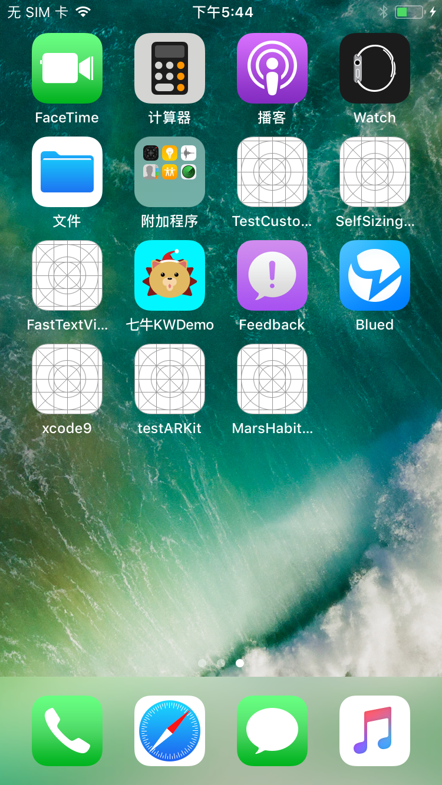

# What’s New in iOS 11

> Your apps can now become more intelligent using the power of machine learning with Core ML. You can create incredible augmented reality experiences with ARKit. And you can deliver a more unified and immersive user experience with new multitasking features, including drag and drop for iPad, the new Files app, new camera APIs, new SiriKit domains, Apple Music integration, and more.

上面这段话，是官网对iOS11新特性的总结：

*  **CoreML**，机器学习库
*  **ARKit**，增强现实
*  **Drag and drop for iPad**，拖拽实现
*  **New File app**， 文档app
*  **Camera API update**， 新相机API
*  **Apple Music**， 集成Apple Music

## File Management
更新了iOS11系统之后，会发现手机多了一个叫文件的app，可用来展示本地文件和云盘文件，如下图

## Drag and Drop
[官方文档地址](https://developer.apple.com/documentation/uikit/drag_and_drop?language=objc)

这个特性，在iPad上比较好。用这个可以将item从一个屏幕拖拽到另外一个屏幕，可以在app内使用，也可以跨app使用。

> 需要注意的一点是，iPad这些特性都支持，但是iPhone只支持app内的拖拽*

下面是官网贴的一个图片，可以从相册把一张图拖拽到邮件里作为附件

