# What’s New in iOS 11

> Your apps can now become more intelligent using the power of machine learning with Core ML. You can create incredible augmented reality experiences with ARKit. And you can deliver a more unified and immersive user experience with new multitasking features, including drag and drop for iPad, the new Files app, new camera APIs, new SiriKit domains, Apple Music integration, and more.

## Session 404: Debug with xcode 9

### new simulator
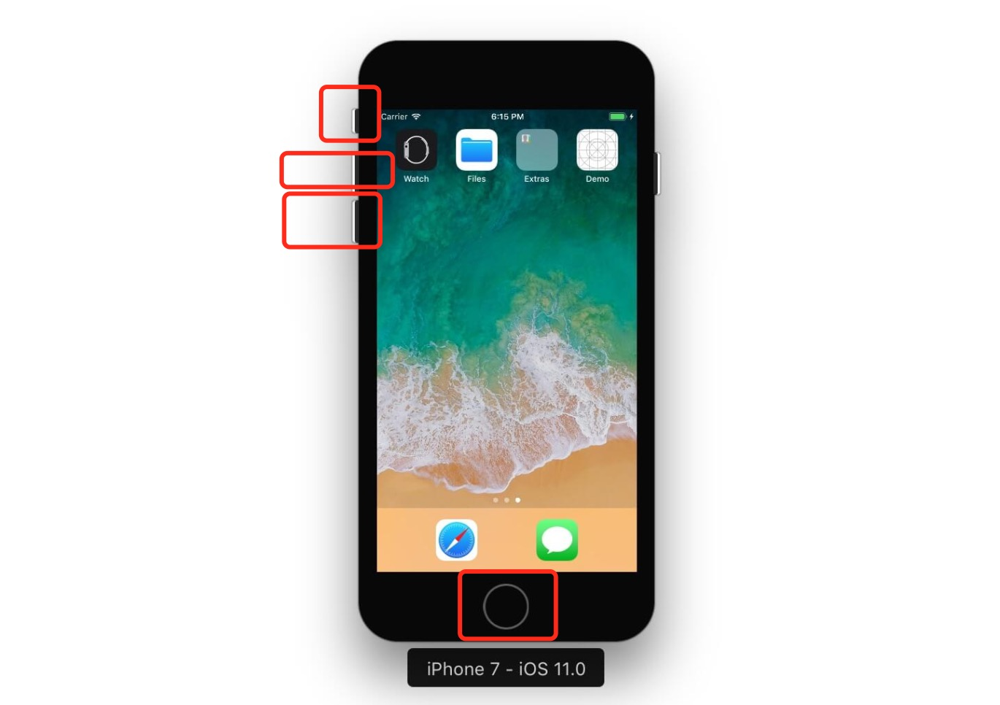

### wireless development

主要是为了方便调试AppleTV ,home 一些东西，这样子你就能坐在沙发上远程调试

最低的要求是：

* iPhone, iPad, iPod touch running on iOS11
* Apple TV running tvOS11
* macOS 10.12.4+

支持的工具：

iOS / tbOS

* Xcode
* Instruments
* Accessibility Inspector
* Console
* Configurator

开启无线调试，在同一个局域网，第一次手机要插线, Window -> Devices and Simulators, 选择设备， 然后勾选 Connect via network

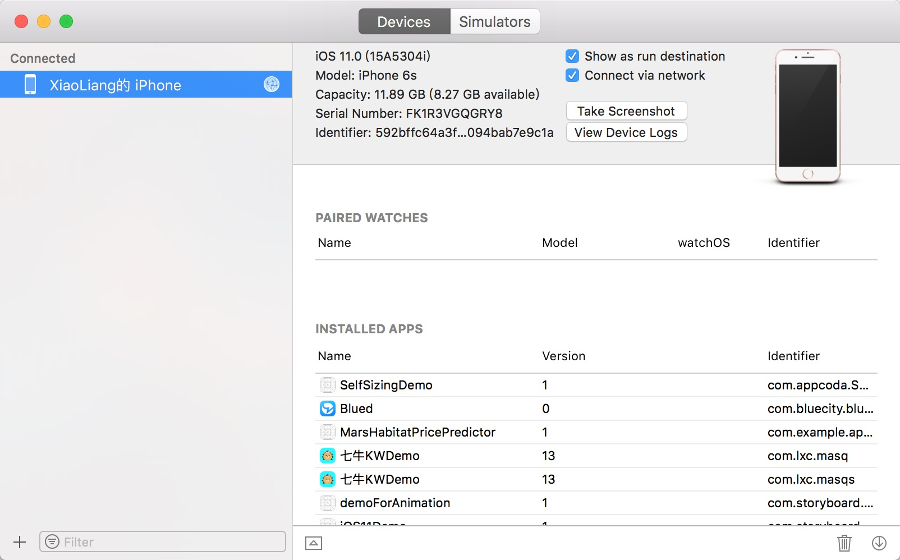

断点调试的改进，

* 断点调试增加了代码补全,在断点的conditions和action fields里面
* 而且还多了个option indicator

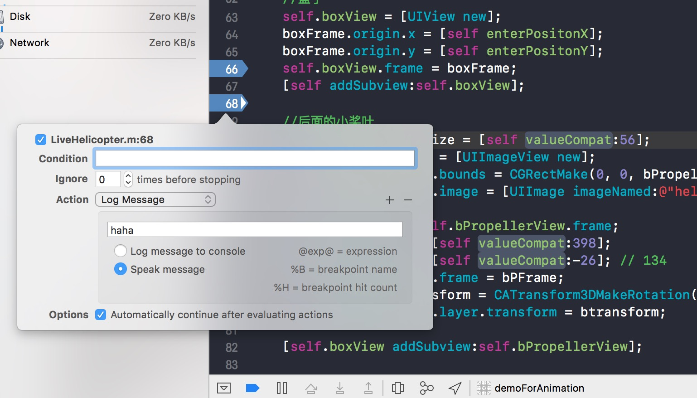

ViewController 调试改进

就是查看view hierarchy的时候，如果层级有好几个viewController,我们可以单独看其中一个
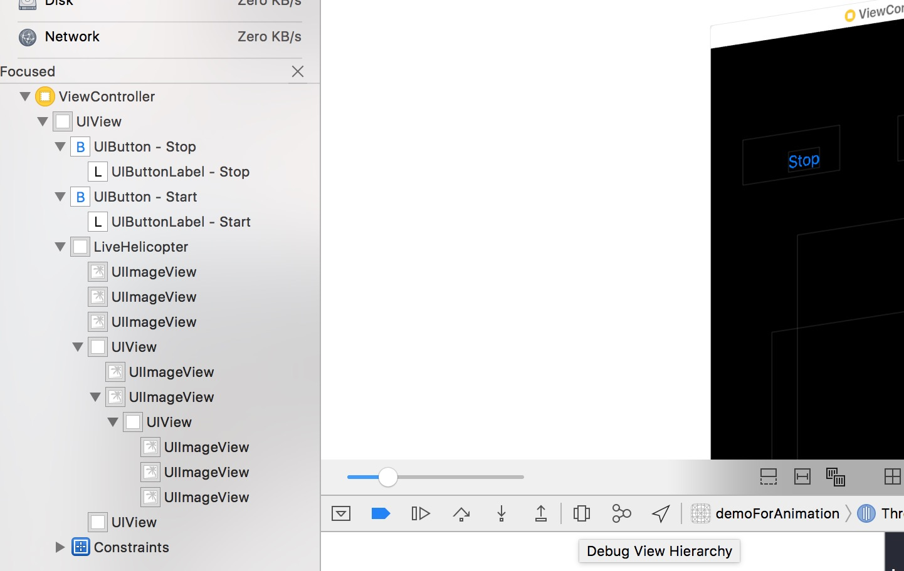

## session 405: GitHub and the New Source Control Workflows in Xcode 9

同样可以添加服务器地址，我试了一下咱们的git服务器好像不行，就是可以在Preference里面输入git的账号

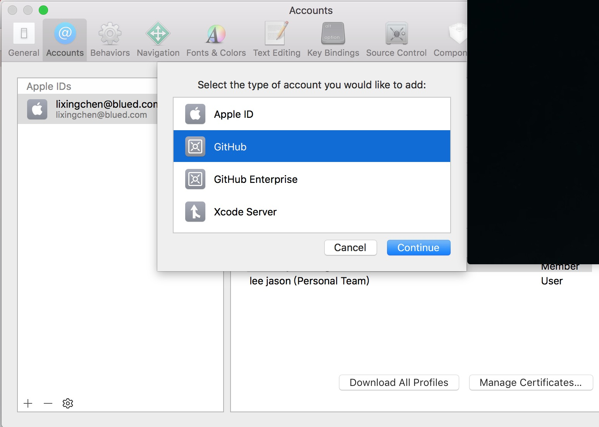

然后重新打开Xcode，会有一个clone from 的选项，点击就会进入这个页面，可以搜索别的repo，或者下载这个
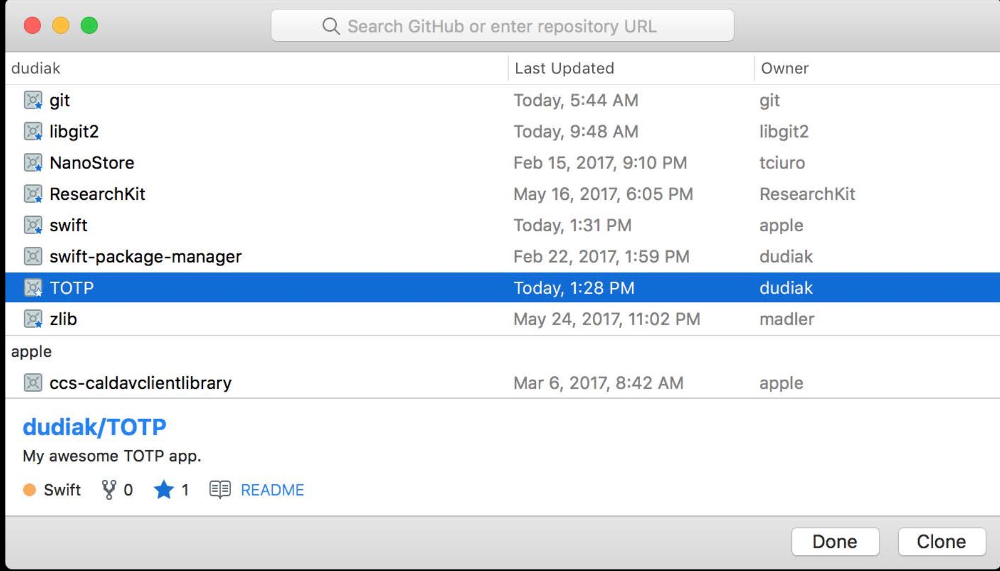

这个是创建分支，如果有两个分支，merge的选项就可以操作
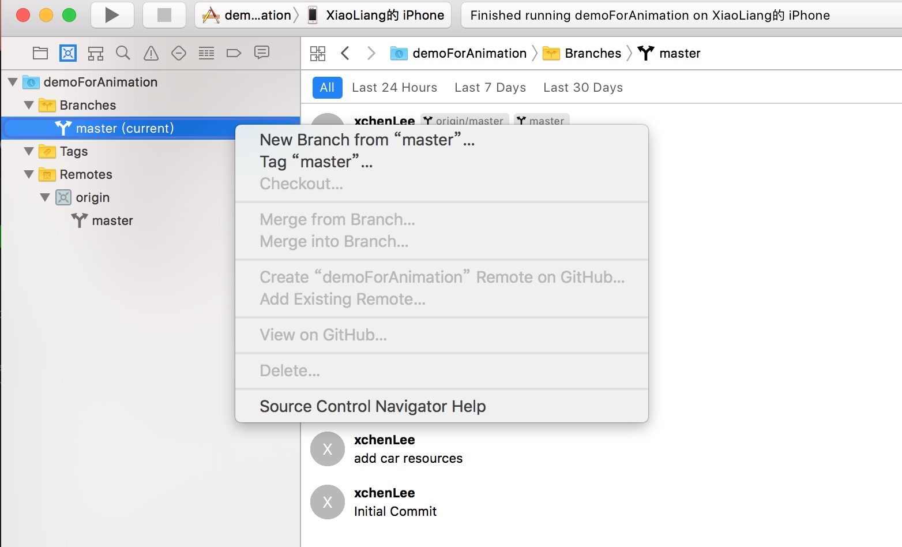

还可以针对某个commit开始打tag
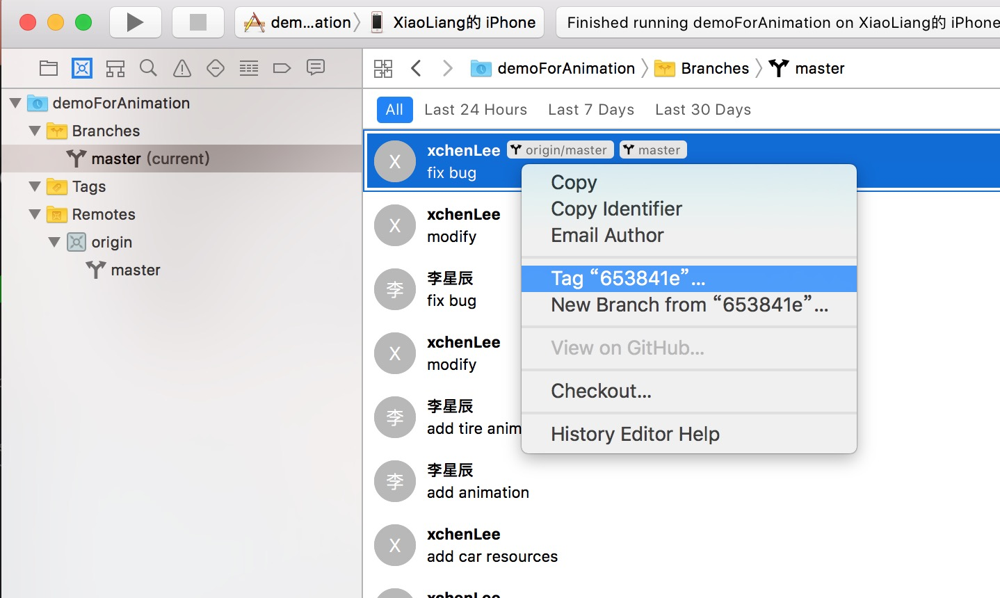

## session401: Localizing with Xcode 9
因为咱们项目有海外版，我就大概扫了一眼这个Session, 这个session主要是三点

* 字符串管理
* 格式化，就是DateFormatter之类的
* UI相关的（**官方举例是如果你在xib,storyboard里面对字符串设置了固定宽高的话，Xcode会给你提示**）

常用的API 大家应该比较熟了，就是不带参数的和需要带一些参数的API，这连个方法

* NSLocalizedString
* LocalizedStringWithFormat

这里特别提到了日期的格式化，这个中英文我记得好像是没问题，但是有些国家的语言会有问题

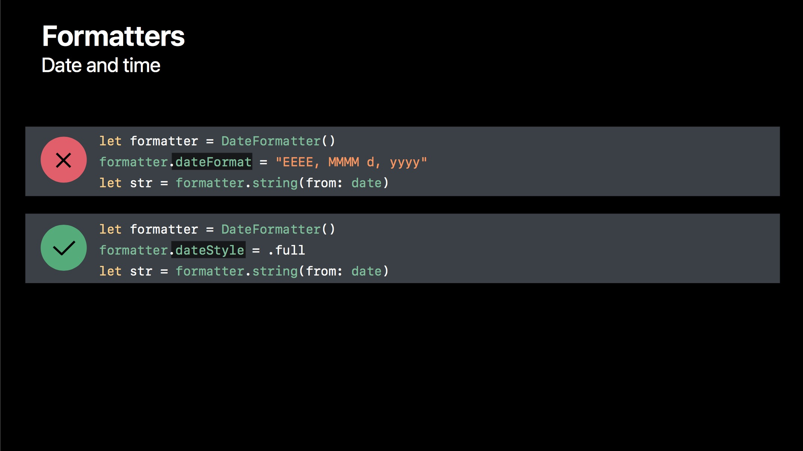
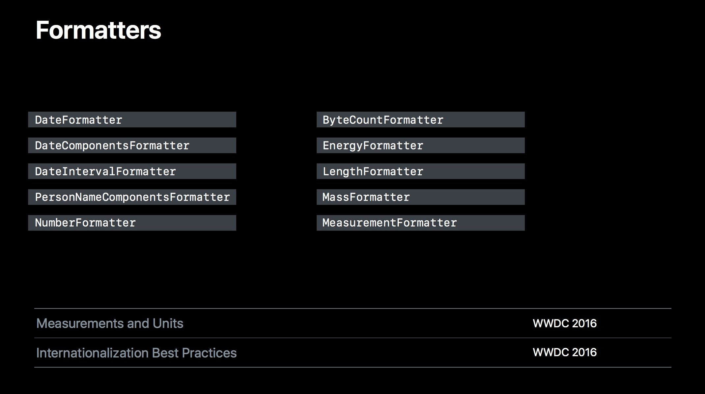
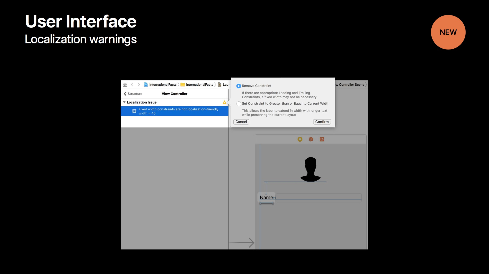

还有一个国际化的新特性，就是可以创建字符串文件管理之类的，没怎么看懂，有兴趣的可以自己看一下

## Drag and Drop
[官方文档地址](https://developer.apple.com/documentation/uikit/drag_and_drop?language=objc)

这个特性，在iPad上比较好。用这个可以将item从一个屏幕拖拽到另外一个屏幕，可以在app内使用，也可以跨app使用。

> 需要注意的一点是，iPad这些特性都支持，但是iPhone只支持app内的拖拽，但是我自己试着写了一个demo，在iPhone上根本不响应事件，断点delegate都不走

下面是官网贴的一个图片，可以从相册把一张图拖拽到邮件里作为附件

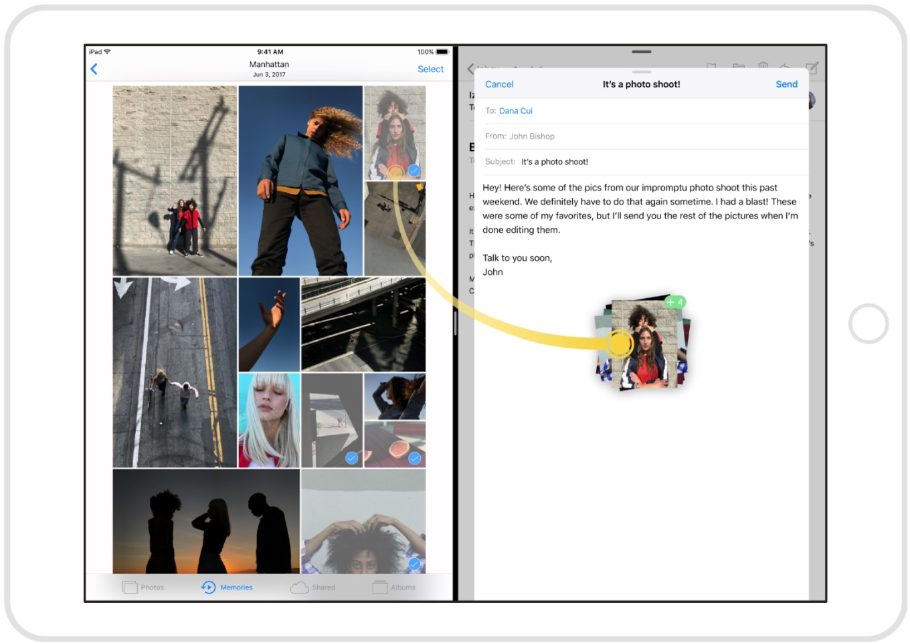

## File Management
更新了iOS11系统之后，会发现手机多了一个叫文件的app，可用来展示本地文件和云盘文件，对于一些网盘app会比较好用，提供了一个系统级的Controller给你用，这个说是高度支持UI自定义

下面的是UIKit提供的一个文件Controller

> UIDocumentBrowserViewController
> 
> class UIDocumentBrowserViewController { 
> 
> init(forOpeningFilesWithContentTypes: [String]?)  
> var delegate: UIDocumentBrowserViewControllerDelegate? 
>  
> }

关于这部分内容，大概有2个session在讲相关的内容，大家有兴趣可以看一下

* Session 229, Building Great Document-based Apps in iOS 11
* Session 243, File Provider Enhancements

    
    
## UI Refinements

* UINavigationBar 增加了大字模式
* UITableViewCell 增加了Swipe Action

> 关于大字模式，有个Session245，是讲如何对你的App的UI布局进行适配的，不过，如果你的app不想支持这种动态字体模式，其实是没有问题的，但是如果有webview相关的会有些问题。

## session245：Building Apps with Dynamic type

这一篇主要讲的是iPhone为了一些特殊群体，比如老人，近视小孩，还有工作一天疲劳的白领等等，提出了大字模式，在设置里的
Display & Brightness 里 改变字体大小。

但是UI会变形，我看了一下系统app，基本都没有问题，只有react-native部分会有些问题，这里提到了适配
iOS 为这些增加了一些API,这个session主要是几点

* 可变的Font sizes
* 适配大字
* 适配UITableView
* 适配图片

下面是简单的对文字的缩放截图了几个，就是通过xib属性面板和代码都可以做到，之前写死的frame 大小，必须得改一下了。UITableView的，只要是做了auto-sizingCell，都会很好自己是配，Session最后还给了怎么给H5页面是配的方案，我这里不一一列举，就是大家以后如果遇到相关的需求，可以查阅一下这个session，

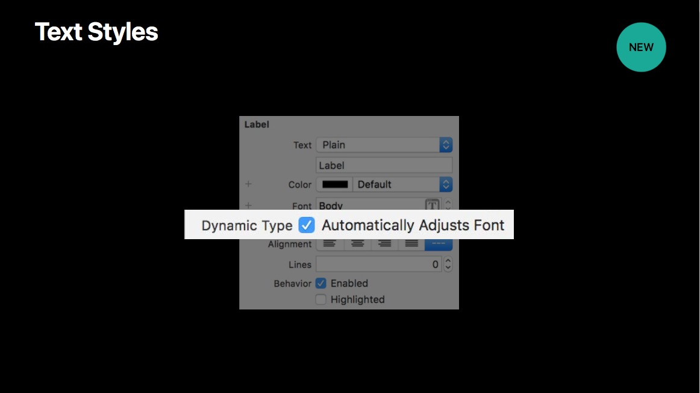
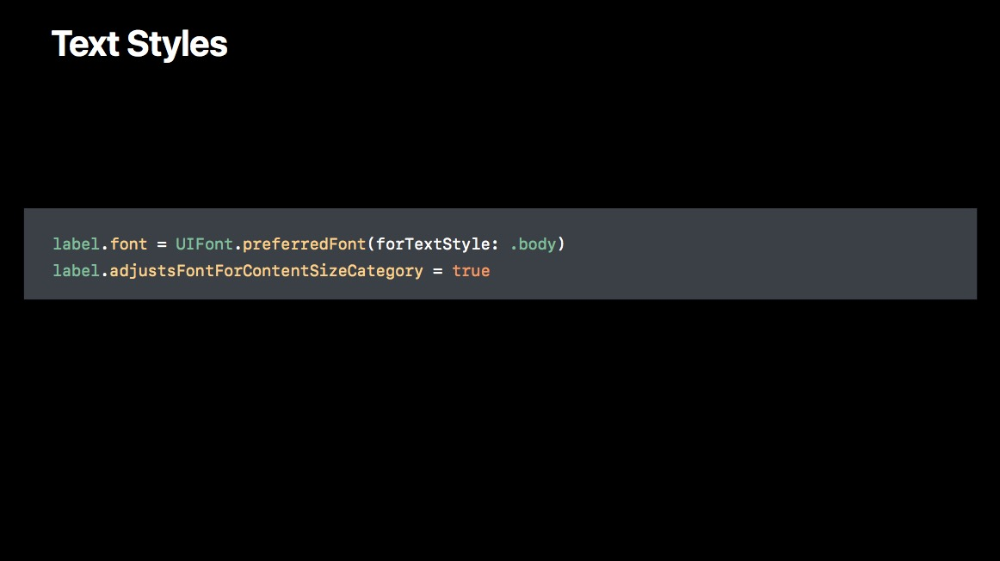
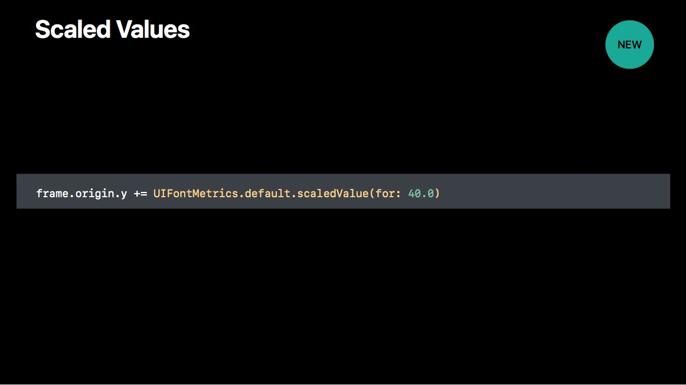

> 对于在大字模式下，H5页面，session提到的有给前端同学使用的相关的解决方案

## session230：Advanced Animation with UIKit
[session230](https://developer.apple.com/videos/play/wwdc2017/230/)

这个Session主要讲动画类的更新，添加了两个属性，使得动画过程更加可控，大家如果需要写一些交互性的动画，可以看一下这个session.

1.UIView-based Animations（不可控制过程的动画）

2.UIViewPropertyAnimator （高度可控动画）

Sesion中列举了这个动画的优点，下面四点

* Custom timing
* Interactive 
* Interrupible
* Responsive

配合UIPanGesture，可以做出来交互性很强的动画。以及，UIViewPropertyAnimator in **iOS11** 新增加的两个属性，提高了动画的体验

//这个属性，名字就是擦洗，擦掉，如果开启，就会根据动画的时间，慢慢的消失掉，擦掉

**var scrubsLinearly: Bool**

//这个属性，就是可以让动画在结束的时候，处在一个开始状态，可以重新再使用

**var pausesOnCompletion: Bool**

## session220: Customized Loading in WKWebView

* 更好的cookie管理机制
* 过滤网页内容
* 对加载的内容可控性更高
* Provide Custom Resources（**没有细看，是可以定义一些 custom schemes**）

之前的项目用WKWebView访问网站，需要种cookie，当时是没有合适的方法，只是通过WKWebView加载网页请求的时候，塞到request 的HttpHeader里，也尝试在加载页面的时候，执行JS脚本写Cookie，iOS11提供了新的API

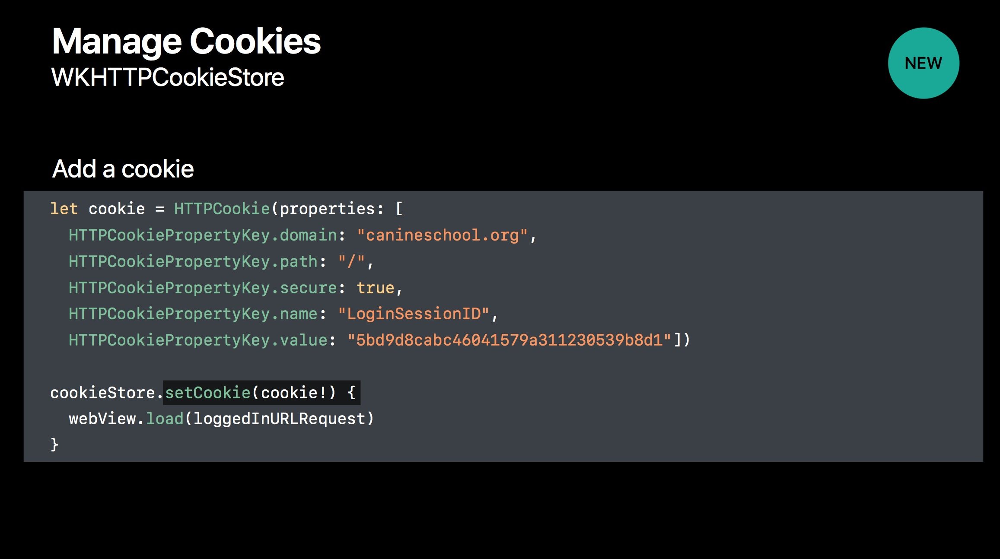

## session241 Introducing PDFKit on iOS
iOS11提供了PDFKit Framework这个库，更方便在移动端进行PDF文档的展示，下面是我从这个session的截图，大概介绍了一下这个库

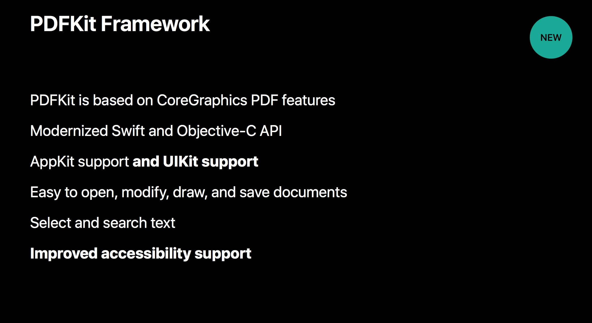

官方也提供了使用这个framework的[Guide](https://developer.apple.com/library/content/documentation/GraphicsImaging/Conceptual/PDFKitGuide/PDFKit_Prog_Intro/PDFKit_Prog_Intro.html)

## session242:The Keys to a Better   Text Input Experience
这个Session 主要讲了，如何提高输入体验，就是键盘相关的，我想大家如果用UITextfield，或者聊天相关的可能会需要注册键盘事件的广播，来调整布局，比如

`UIKeyboardDidShow`

`UIKeyboardDidHide `

`UIKeyboardDidChangeFrame`

这个session针对UITableView和UIScrollView，以及一些不能滑动的控件提出了好的编码建议

一个是针对输入框，可以自动填写密码，

## Core ML 
支持层数超过30层的深度学习之外，还支持决策树的融合，SVM（支持向量机），线性模型。由于其底层建立在Metal 和Accelerate等技术上，所以可以最大限度的发挥CPU和GPU的优势。你可以在移动设备上运行机器学习模型

[官网文档](https://developer.apple.com/documentation/coreml)

### Vison
这个是基于ML的，可以进行脸部追踪，识别，文字检测，二维码检测，物体识别

[官网文档](https://developer.apple.com/documentation/vision)

### Natural Language Processing
包括语言识别，分词，词性还原，词性判定，实体辨识

## ARKit

## Session 402 What's new in swift

## 参考资料
[wwdc 2017](https://developer.apple.com/videos/wwdc2017/)

###扩展阅读
[你可能需要为你的 APP 适配 iOS 11](http://mp.weixin.qq.com/s/AZFrqL9dnlgA6Vt2sVhxIw)
